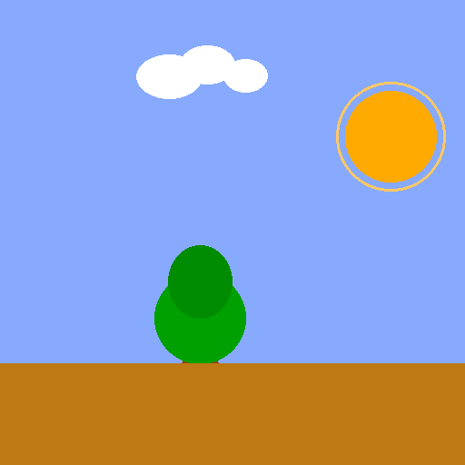

# 🌳 p5.js Variables Exercise

A simple scene built using **p5.js** to practice working with variables, positioning, and scaling.

This exercise demonstrates how variables can control object placement and size within a 2D canvas.

---

## 🎯 What This Exercise Covers

- Declaring global variables
- Initializing values inside `setup()`
- Using variables to control object position
- Using scaling factors
- Drawing multiple objects using coordinates

---

## 📂 Project Structure

```
project-folder/
│
├── index.html
├── sketch.js
└── p5.min.js
```

---

## 🧠 Core Concepts Used

### 1️⃣ Variables

```javascript
var treePos_x;
var cloudPos_x;
var cloudScale;
```

These variables control:

- Tree horizontal position
- Cloud horizontal position
- Cloud size scaling

---

### 2️⃣ Initialization

Inside `setup()`:

```javascript
treePos_x = 200;
cloudPos_x = 220;
cloudScale = 1.5;
```

This sets the starting values for the scene.

---

### 3️⃣ Scene Composition

The scene includes:

- 🌤 Sky (background color)
- ☀ Sun
- 🌳 Tree (trunk + leaves)
- ☁ Cloud (scaled using a multiplier)
- 🌾 Ground

---

## 📏 Cloud Scaling Logic

The cloud uses:

```javascript
50 * cloudScale
```

This demonstrates proportional scaling of shapes.

Changing `cloudScale` changes the cloud size dynamically.

---

## 🚀 Learning Outcome

This exercise helps understand:

- How variables control drawing behavior
- How position values affect layout
- How scaling works mathematically
- How to structure simple visual scenes

---

## 👨‍💻 Author

Jamal Salem  
Computer Engineer

---

## 📜 License

Open-source for educational purposes.


---

## 🎬 Demo Preview

<div align="center">
  
</div>

---


